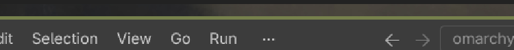

# AI Avatar

Little AI avatars that **roam in a strip just under your Omarchy bar** — one per
AI CLI that's running (Claude Code, Codex, aider, ollama…). They wander about
with randomized paths, speeds and pauses, and vanish when their AI stops. Pure
ambient presence: the strip is transparent and click-through, so it never gets
in your way.



## How it works

A tiny `pgrep` runs on a timer (default every 1.5s) looking for the configured
process names. Each one that's running gets its own avatar in a full-width,
click-through overlay pinned just below the bar. Each avatar's **head is that
AI's logo** (tinted to your theme, so it matches every theme), with drawn legs;
it falls back to a robot glyph for any AI without a logo. Claude and Codex reuse
Omarchy's own shipped logos.

### Custom AI logos

Drop an SVG named after the process into `assets/` to give any AI its own head
(and to override the built-ins):

```
assets/ollama.svg
assets/gemini.svg
assets/aider.svg
```

The file name must match the process name in your `processes` setting. Monochrome
SVGs look best — they're tinted to your theme color.

## Install

```bash
omarchy plugin add https://github.com/hlasensky/omarchy-ai-avatar.git --enable
```

Plugins land **disabled** until you review them; `--enable` opts in. It drops
into the bar's right section — move it with
`omarchy bar move hl.ai_avatar --section <left|center|right>`.

## Update

```bash
omarchy plugin update hl.ai_avatar
```

## Uninstall

```bash
omarchy plugin remove hl.ai_avatar
```

This disables the widget, removes it from the bar (`shell.json`), and deletes
the plugin from `~/.config/omarchy/plugins/`.

## Requirements

- `pgrep` (from `procps-ng`, ships with Omarchy).
- A Nerd Font as the bar font (Omarchy default) for the robot fallback glyph.
- Hyprland (the Omarchy compositor) — the roaming strip is a `wlr-layer-shell`
  overlay.

## Settings

Configure from **Setup → Plugins**, or edit the widget entry in
`~/.config/omarchy/shell.json`.

| Key              | Type        | Default                                        | What it does                          |
|------------------|-------------|------------------------------------------------|---------------------------------------|
| `processes`      | multiselect | claude, codex, aider, ollama, gemini           | Process names that count as "AI busy" |
| `pollIntervalMs` | integer     | 1500                                           | How often to check (ms)               |
| `walkSpeed`      | integer     | 1600                                           | Walk lap duration (ms) — lower = faster |

Matching is by **process name** (`pgrep -l`), so merely opening a file that
mentions an AI name won't trigger it. A CLI launched under a wrapper whose
process name differs (e.g. `node`) won't match unless you add that name.

## License

MIT — see [LICENSE](LICENSE).
